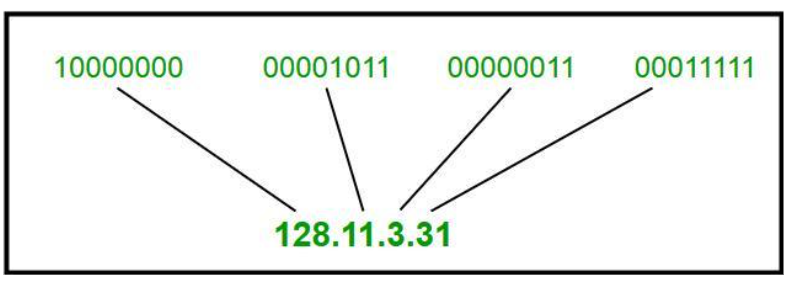
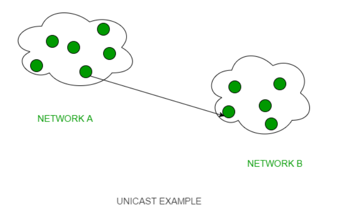
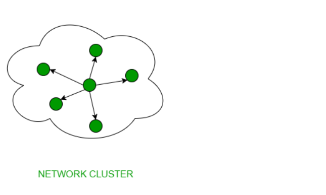
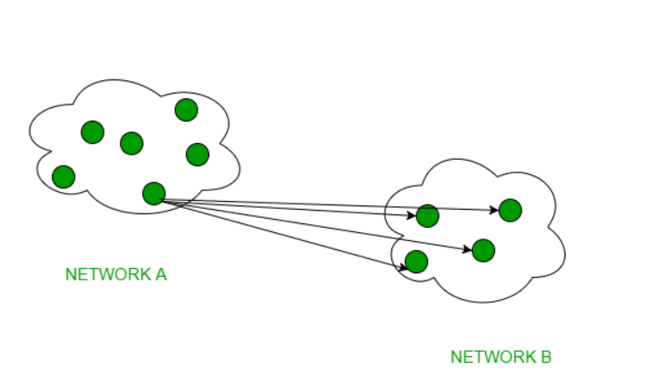

# IP Address ( Internet Protocol address):
**IP Address (Internet Protocol address):**
All the computers of the world in the Internet network communicate with each other with underground or underwater cables or wirelessly. If you want to download a file from the internet or load a web page or literally do anything related to the internet, your computer must have an address so that other computers can find and locate your computer in order to deliver that particular file or webpage that you are requesting. In technical terms, that address is called IP Address or Internet Protocol Address.
Let us understand it with another example, like if someone wants to send you a mail then he/she must have your home address. Similarly, your computer too needs an address so that other computers on the internet can communicate with each other without the confusion of delivering information to someone else’s computer. And that is why each computer in this world has a unique IP Address. Or in other words, an IP address is a unique address that is used to identify computers or nodes on the internet. This address is just a string of numbers written in a certain format. It is generally expressed in the set of numbers for example 192.155.12.1. Here each number in the set is from 0 to 255 range. Or we can say that a full IP address ranges from 0.0.0.0 to 255.255.255.255. And these IP addresses are assigned by IANA(known as Internet Corporation For Internet Assigned Numbers Authority). 

Also known as the Logical Address, the IP Address is the network address of the system across the network. 
To identify each device in the world-wide-web, the Internet Assigned Numbers Authority (IANA) assigns an IPV4 (Version 4) address as a unique identifier to each device on the Internet. 
The length of an IPv4 address is 32-bits, hence, we have 232 IP addresses available. The length of an IPv6 address is 128-bits.

Structure of IP Address:
- IP addresses are displayed as a set of 4 numbers.
- Each number on the set may range from 0 to 255.
- Total IP addresses range ranges from 0.0.0.0 to 255.255.255.255.
- IP addresses are basically divided into two parts:
    1. Network ID
    2. Host ID

**Network ID:**
A network ID or NetID is the fragment of IP address that classifies the network for a specified host i.e., it tells us which network the host belongs to, generally comprised of one to up to four octets in dotted-decimal representation.

In dotted-decimal representation, an IP address is divided into four octets and based on which class the IP address belongs to its octets are further divided into network ID and HOST ID.

For Class A first octet represents network ID as the prefix of the first octet is 0, it uses the remaining 7 bits for network ID, for Class B first and second octets represent network ID the prefix for class B is 10 so it uses the remaining 14 bits for network ID, for Class C first, second and third octet represents network ID the prefix of class C is 110 so it uses the remaining 21 bits for network ID, Class D, and Class E are reserved.

**Host ID:**
It is the fragment of an IP address that uniquely classifies a host on a specified TCP/IP network. A host ID can be found simply by ANDing the IP address in binary form with its respective default subnet mask (in binary form). The other fragment of an IP address is the network ID, which identifies the network to which the host belongs.

For Example, In the above Image, the IP address of host C is 198.162.30.4 that means it belongs to class C, so its default subnet mask will be 255.255.255.0; Now applying AND on both, it will give the host ID 0.0.0.4 and network ID 198.162.30.0.

## MAC Address (Media Access Control address): 
Also known as physical address, the MAC Address is the unique identifier of each host and is associated with its NIC (Network Interface Card). 
A MAC address is assigned to the NIC at the time of manufacturing. 
The length of the MAC address is : 12-nibble/ 6 bytes/ 48 bits.

## Difference Between MAC & IP Address:

Both MAC Address and IP Address are used to uniquely define a device on the internet. NIC Card’s Manufacturer provides the MAC Address, on the other hand, Internet Service Provider provides IP Address. 
The main difference between MAC and IP address is that MAC Address is used to ensure the physical address of the computer. It uniquely identifies the devices on a network. While IP addresses are used to uniquely identifies the connection of the network with that device takes part in a network. 
Let’s see the difference between MAC Address and IP Address:

## IP Address Representation:
1. Dotted decimal :- It is represented by decimal number in which 32 Bit IP address is divided in four octets separated by '.'.
Example:-172.16.30.56
2. Binary representation:- In this IP address is represented by binary numbers 0 or 1 with octets separated by '.'.
Example : 11001100.01010101.10101010.00001111
3. Hexadecimal representation:- It is represented by hexadecimal number from 0-9 and A-F, where octets are separated by '.'.
Example: 82 39 1E 38

# Classful IP addressing Part - 1

## Introduction To Binary Number System

- 1 bit - 0 or 1
- 1 byte - 8 bits
- 1kb - 1024 bytes =2^10
- 1mb - 1024 kb= 2^20
- 1gb - 1024 mb=2^30
- 1tb - 1024 gb=2^40

IP address is an address having information about how to reach a specific host, especially outside the LAN. An IP address is a 32 bit unique address having an address space of 2^32.

**Example:** 

Generally, there are two notations in which IP address is written, dotted decimal notation and hexadecimal notation.

**Dotted Decimal Notation:**

**Hexadecimal Notation:**

**Some points to be noted about dotted decimal notation:**

1. The value of any segment (byte) is between 0 and 255 (both included).
2. There are no zeroes preceding the value in any segment (054 is wrong, 54 is correct).

# Casting
### Types of Casting:
1. UNICAST
2. BROADCAST
    1. Limited Broadcast
    2. Directed Broadcast
3. MULTICAST

**Unicast:**

This type of information transfer is useful when there is a participation of single sender and single recipient. So, in short, you can term it as a one-to-one transmission. For example, a device having IP address 10.1.2.0 in a network wants to send the traffic stream(data packets) to the device with IP address 20.12.4.2 in the other network, then unicast comes into the picture. This is the most common form of data transfer over the networks. 

**Broadcast:**

Broadcasting transfer (one-to-all) techniques can be classified into two types : 

**Limited Broadcasting:**
Suppose you have to send stream of packets to all the devices over the network that you reside, this broadcasting comes handy. For this to achieve, it will append 255.255.255.255 (all the 32 bits of IP address set to 1) called as Limited Broadcast Address in the destination address of the datagram (packet) header which is reserved for information transfer to all the recipients from a single client (sender) over the network.

**Direct Broadcasting:**
This is useful when a device in one network wants to transfer packet stream to all the devices over the other network. This is achieved by translating all the Host ID part bits of the destination address to 1, referred as Direct Broadcast Address in the datagram header for information transfer.

This mode is mainly utilized by television networks for video and audio distribution.
One important protocol of this class in Computer Networks is Address Resolution Protocol (ARP) that is used for resolving IP address into physical address which is necessary for underlying communication. 

**Multicast:**

In multicasting, one/more senders and one/more recipients participate in data transfer traffic. In this method traffic recline between the boundaries of unicast (one-to-one) and broadcast (one-to-all). Multicast lets server’s direct single copies of data streams that are then simulated and routed to hosts that request it. IP multicast requires support of some other protocols like IGMP (Internet Group Management Protocol), Multicast routing for its working. Also in Classful IP addressing Class D is reserved for multicast groups.

# Types of IP address
### There are two types of IP addresses:
1. Private
2. Public

- Private IP address are used in LAN.
- Public IP address are used over Internet.

- Range of IP addresses:

1. Range of Private IP addresses:
- 10.0.0.0 – 10.255.255.255, 
- 172.16.0.0 – 172.31.255.255, 
- 192.168.0.0 – 192.168.255.255

2. Range of Public IP addresses:
All Other IP addresses other than Private IP addresses.

- Scope of IP addresses:
    - Private has scope of Local upto LAN.
    - Public has scope of global.

### Working of IP addresses:
The working of IP addresses is similar to other languages. It can also use some set of rules to send information. Using these protocols we can easily send, receive data or files to the connected devices. There are several steps behind the scenes. Let us look at them

- Your device directly requests your Internet Service Provider which then grants your device access to the web.
- And an IP Address is assigned to your device from the given range available.
- Your internet activity goes through your service provider, and that they route it back to you, using your IP address.
- Your IP address can change. For example, turning your router on or off can change your IP Address.
- When you are out from your home location your home IP address doesn’t accompany you. It changes as you change the network of your device.

Why use Private IP Address:

- The purpose of Private IP addresses is to use IP addresses.
- In every LAN network Private IP is used,same Private address can be used in other LANs because the scope of the LAN is local
