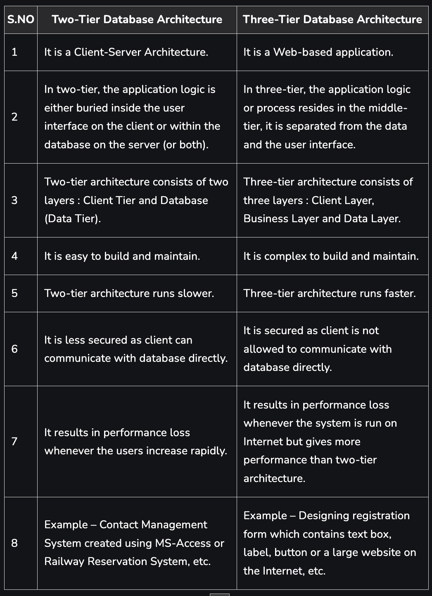

# What is Data and Database?
**Data -** Data is a collection of a distinct small unit of information. It can be used in a variety of forms like text, numbers, media, bytes, etc. it can be stored in pieces of paper or electronic memory, etc.

Word 'Data' is originated from the word 'datum' that means 'single piece of information.' It is plural of the word datum.

In computing, Data is information that can be translated into a form for efficient movement and processing. Data is interchangeable.

**Database -** A database is an organized collection of data, so that it can be easily accessed and managed.

You can organize data into tables, rows, columns, and index it to make it easier to find relevant information.

Database handlers create a database in such a way that only one set of software program provides access of data to all the users.

The main purpose of the database is to operate a large amount of information by storing, retrieving, and managing data.

There are many dynamic websites on the World Wide Web nowadays which are handled through databases. For example, a model that checks the availability of rooms in a hotel. It is an example of a dynamic website that uses a database.

There are many databases available like MySQL, Sybase, Oracle, MongoDB, Informix, PostgreSQL, SQL Server, etc.

Modern databases are managed by the database management system (DBMS).

SQL or Structured Query Language is used to operate on the data stored in a database. SQL depends on relational algebra and tuple relational calculus.

A cylindrical structure is used to display the image of a database.

# What is DBMS ( Database Management System ) with example?
Database Management System (DBMS) is software for storing and retrieving user's data while considering appropriate security measures. It consists of a group of programs that manipulate the database. The DBMS accepts the request for data from an application and instructs the operating system to provide the specific data. In large systems, a DBMS helps users and other third-party software store and retrieve data. DBMS allows users to create their own databases as per their requirements. The term “DBMS” includes the user of the database and other application programs. It provides an interface between the data and the software application. Some popular example are MySql, Oracle, dBASE, MariaDB, IBM DB2 etc.

# Why do we need DBMS?
A Data Base Management System is a system software for easy, efficient and reliable data processing and management. It can be used for Creation of a database, Retrieval of information from the database, Updating the database, Managing a database, Multiple User Interface, Data scalability, expandability and flexibility.
Overall the time for developing an application is reduced with the help of the DBMS. Some most common use of DBMS are listed below -
1. Data Organization and Management
2. Data Security and Privacy
3. Data Integrity and Consistency
4. Concurrent Data Access
5. Data Analysis and Reporting
6. Scalability and Flexibility
7. Cost-Effectiveness

# Difference between File Management System and DBMS?
[Click Here For Article](https://www.geeksforgeeks.org/difference-between-file-system-and-dbms/)

# What is Database Admin and it's fuction?
A Database Administrator (DBA) is an individual or person responsible for controlling, maintaining, coordinating, and operating a database management system. Managing, securing, and taking care of the database systems is a prime responsibility. They are responsible and in charge of authorizing access to the database, coordinating, capacity, planning, installation, and monitoring uses, and acquiring and gathering software and hardware resources as and when needed. Their role also varies from configuration, database design, migration, security, troubleshooting, backup, and data recovery. Database administration is a major and key function in any firm or organization that is relying on one or more databases.
Role and Duties of Database Administrator (DBA) :
1. Decides hardware – They decide on economical hardware, based on cost, performance, and efficiency of hardware, and best suits the organization. It is hardware that is an interface between end users and the database.
2. Manages data integrity and security – Data integrity needs to be checked and managed accurately as it protects and restricts data from unauthorized use. DBA eyes on relationships within data to maintain data integrity.
3. Database Accessibility –  Database Administrator is solely responsible for giving permission to access data available in the database. It also makes sure who has the right to change the content.
4. Database design – DBA is held responsible and accountable for logical, physical design, external model design, and integrity and security control.
5. Database implementation – DBA implements DBMS and checks database loading at the time of its implementation.
6. Query processing performance – DBA enhances query processing by improving speed, performance, and accuracy.
7. Tuning Database Performance – If the user is not able to get data speedily and accurately then it may lose organization’s business. So by tuning SQL commands DBA can enhance the performance of the database.

# Describe Database Tier-2 and Tier-3 Architecture
1. **Two-Tier Database Architecture –** In two-tier, the application logic is either buried inside the User Interface on the client or within the database on the server (or both). With two-tier client/server architectures, the user system interface is usually located in the user’s desktop environment and the database management services are usually in a server that is a more powerful machine that services many clients.

2. **Three-Tier Database Architecture –** In three-tier, the application logic or process lives in the middle-tier, it is separated from the data and the user interface. Three-tier systems are more scalable, robust and flexible. In addition, they can integrate data from multiple sources. In the three-tier architecture, a middle tier was added between the user system interface client environment and the database management server environment. There are a variety of ways of implementing this middle tier, such as transaction processing monitors, message servers, or application servers.

# Database languages
Structured Query Language(SQL) as we all know is the database language by the use of which we can perform certain operations on the existing database and also we can use this language to create a database. SQL uses certain commands like CREATE, DROP, INSERT, etc. to carry out the required tasks.SQL commands are like instructions to a table. It is used to interact with the database with some operations. It is also used to perform specific tasks, functions, and queries of data. SQL can perform various tasks like creating a table, adding data to tables, dropping the table, modifying the table, set permission for users.

These SQL commands are mainly categorized into five categories:
1. DDL – Data Definition Language
2. DQL – Data Query Language
3. DML – Data Manipulation Language
4. DCL – Data Control Language
5. TCL – Transaction Control Language

**DDL (Data Definition Language) -**
DDL or Data Definition Language actually consists of the SQL commands that can be used to define the database schema. It simply deals with descriptions of the database schema and is used to create and modify the structure of database objects in the database. DDL is a set of SQL commands used to create, modify, and delete database structures but not data. These commands are normally not used by a general user, who should be accessing the database via an application.

List of DDL commands: 

CREATE: This command is used to create the database or its objects (like table, index, function, views, store procedure, and triggers).
DROP: This command is used to delete objects from the database.
ALTER: This is used to alter the structure of the database.
TRUNCATE: This is used to remove all records from a table, including all spaces allocated for the records are removed.
COMMENT: This is used to add comments to the data dictionary.
RENAME: This is used to rename an object existing in the database.

**DQL (Data Query Language) -**
DQL statements are used for performing queries on the data within schema objects. The purpose of the DQL Command is to get some schema relation based on the query passed to it. We can define DQL as follows it is a component of SQL statement that allows getting data from the database and imposing order upon it. It includes the SELECT statement. This command allows getting the data out of the database to perform operations with it. When a SELECT is fired against a table or tables the result is compiled into a further temporary table, which is displayed or perhaps received by the program i.e. a front-end.

List of DQL: 

SELECT: It is used to retrieve data from the database.

**DML(Data Manipulation Language) -**
The SQL commands that deal with the manipulation of data present in the database belong to DML or Data Manipulation Language and this includes most of the SQL statements. It is the component of the SQL statement that controls access to data and to the database. Basically, DCL statements are grouped with DML statements.

List of DML commands: 

INSERT: It is used to insert data into a table.
UPDATE: It is used to update existing data within a table.
DELETE: It is used to delete records from a database table.
LOCK: Table control concurrency.
CALL: Call a PL/SQL or JAVA subprogram.
EXPLAIN PLAN: It describes the access path to data.

**DCL (Data Control Language) -**
DCL includes commands such as GRANT and REVOKE which mainly deal with the rights, permissions, and other controls of the database system. 

List of  DCL commands: 

GRANT: This command gives users access privileges to the database.

Syntax:
GRANT SELECT, UPDATE ON MY_TABLE TO SOME_USER, ANOTHER_USER;  

REVOKE: This command withdraws the user’s access privileges given by using the GRANT command.

Syntax:
REVOKE SELECT, UPDATE ON MY_TABLE FROM USER1, USER2;  

**TCL (Transaction Control Language) -**
Transactions group a set of tasks into a single execution unit. Each transaction begins with a specific task and ends when all the tasks in the group successfully complete. If any of the tasks fail, the transaction fails. Therefore, a transaction has only two results: success or failure. You can explore more about transactions here. Hence, the following TCL commands are used to control the execution of a transaction: 

BEGIN: Opens a Transaction.

COMMIT: Commits a Transaction.

Syntax:
COMMIT;  

ROLLBACK: Rollbacks a transaction in case of any error occurs.

Syntax:
ROLLBACK;  

SAVEPOINT: Sets a save point within a transaction.

Syntax:
SAVEPOINT SAVEPOINT_NAME;  
