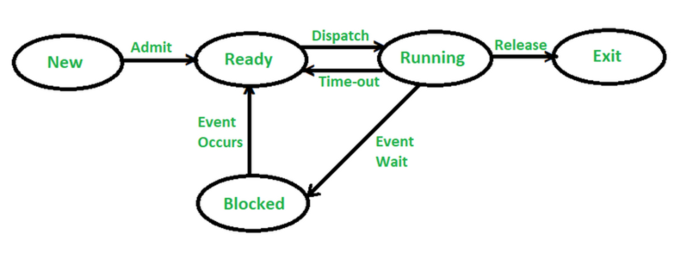
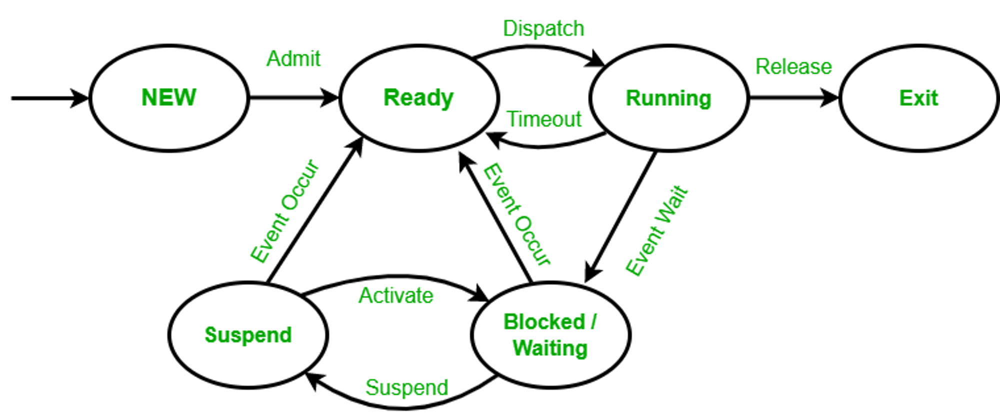

# Operating System
An operating system acts as an intermediary between the user of a computer and computer hardware. The purpose of an operating system is to provide an environment in which a user can execute programs conveniently and efficiently.
An operating system is a software that manages computer hardware. The hardware must provide appropriate mechanisms to ensure the correct operation of the computer system and to prevent user programs from interfering with the proper operation of the system.
1. An operating system is a program that controls the execution of application programs and acts as an interface between the user of a computer and the computer hardware.
2. A more common definition is that the operating system is the one program running at all times on the computer (usually called the kernel), with all else being application programs.
3. An operating system is concerned with the allocation of resources and services, such as memory, processors, devices, and information. The operating system correspondingly includes programs to manage these resources, such as a traffic controller, a scheduler, a memory management module, I/O programs, and a file system.

## Goal of Operating System
1. Convenience( Primary goal)
2. Efficiency (Secondary goal)

## Functions of Operating System
1. Process management
2. Memory management
3. Storage management
4. Protection and Security
5. Input-Output management

## 1. Process Management
1. Creating and deleting user and system processes.
2. Suspending and resuming processes.
3. Process synchronization.
4. Inter-process communication.
5. Deadlock Handling.

## 2. Memory management
1. Deciding which process and data to move into and out of memory.
2. Keeping tracks of which part of memory are currently being used and by whom.
3. Allocating and deallocating memory space as needed.

## 3. Storage management
1. File-System Management
    - Creating and deleting files.
    - Creating and deleting directories to organize files.
    - Supporting primitives for manipulating files and directories.
    - Mapping files into secondary storage.
    - Backing up files on stable(non volatile) storage media.
2. Mass-Storage Management
    - Free space management
    - Storage allocation
    - Disk Scheduling

## 4. Protection and Security
The operating system uses password protection to protect user data and similar other techniques. It also prevents unauthorized access to programs and user data.

## 5. I/O System Management
The module that keeps track of the status of devices is called the I/O traffic controller. Each I/O device has a device handler that resides in a separate process associated with that device.

The I/O subsystem consists of -

- A memory Management component that includes buffering, caching and spooling.
- A general device driver interface.

# Process Concept
Early Computer - One program at a time 
Modern Computer - Multiprogramming, Multitasking

**Process:** A process is a program in execution.

A process includes
1. Program Counter
2. Content of the processor’s register.

## Program vs Process
A process is a program in execution. For example, when we write a program in C or C++ and compile it, the compiler creates binary code. The original code and binary code are both programs. When we actually run the binary code, it becomes a process.
A process is an ‘active’ entity, instead of a program, which is considered a ‘passive’ entity. A single program can create many processes when run multiple times; for example, when we open a .exe or binary file multiple times, multiple instances begin (multiple processes are created).

## What does a process look like in memory?

## Process States
- **New (Create)** – In this step, the process is about to be created but not yet created, it is the program which is present in secondary memory that will be picked up by OS to create the process.
- **Ready** – New -> Ready to run. After the creation of a process, the process enters the ready state i.e. the process is loaded into the main memory. The process here is ready to run and is waiting to get the CPU time for its execution. Processes that are ready for execution by the CPU are maintained in a queue for ready processes.
- **Run** – The process is chosen by CPU for execution and the instructions within the process are executed by any one of the available CPU cores.
- **Blocked or wait** – Whenever the process requests access to I/O or needs input from the user or needs access to a critical region(the lock for which is already acquired) it enters the blocked or wait state. The process continues to wait in the main memory and does not require CPU. Once the I/O operation is completed the process goes to the ready state.
- **Terminated or completed** – Process is killed as well as PCB is deleted.
- **Suspend ready** – Process that was initially in the ready state but were swapped out of main memory(refer Virtual Memory topic) and placed onto external storage by scheduler are said to be in suspend ready state. The process will transition back to ready state whenever the process is again brought onto the main memory.
- **Suspend wait or suspend blocked** – Similar to suspend ready but uses the process which was performing I/O operation and lack of main memory caused them to move to secondary memory. When work is finished it may go to suspend ready.

# Process Control Block

A process control block (PCB) contains information about the process, i.e. registers, quantum, priority, etc. The process table is an array of PCB’s, that means logically contains a PCB for all of the current processes in the system.

1. **Process state** – It stores the respective state of the process.
2. **Pointer** – It is a stack pointer which is required to be saved when the process is switched from one state to another to retain the current position of the process.
3. **Process number** – Every process is assigned with a unique id known as process ID or PID which stores the process identifier.
4. **Program counter** – It stores the counter which contains the address of the next instruction that is to be executed for the process.
5. **Register** – These are the CPU registers which includes: accumulator, base, registers and general purpose registers.
6. **CPU Scheduling Information** - It stores the scheduling information
7. **Memory limits** – This field contains the information about memory management system used by operating system. This may include the page tables, segment tables etc.
8. **Open files list** – This information includes the list of files opened for a process.

# Process State Transition
A process is a program under execution that consists of a number of elements including, program code and a set of data. To execute a program, a process has to be created for that program. Here the process may or may not run but if it is in a condition of running then that has to be maintained by the OS for appropriate progress of the process to be gained.

## Five-State Process Model
This model consists of five states i.e, running, ready, blocked, new, and exit. The model works when any new job/process occurs in the queue, it is first admitted in the queue after that it goes in the ready state. Now in the Ready state, the process goes in the running state. In the running state, a process has two conditions i.e., either the process goes to the event wait or the process gets a time-out.

If the process has timed out, then the process again goes to the ready state as the process has not completed its execution. If a process has an event wait condition then the process goes to the blocked state and after that to the ready state. If both conditions are true, then the process goes to running state after dispatching after which the process gets released and at last it is terminated.

### Possible State Transitions

There can be various events that lead to a state transition for a process. The possible state transitions are given below:

1. **Null -> New:** A new process is created for the execution of a process.
2. **New -> Ready:** The system will move the process from new to ready state and now it is ready for execution. Here a system may set a limit so that multiple processes can’t occur otherwise there may be a performance issue.
3. **Ready -> Running:** The OS now selects a process for a run and the system chooses only one process in a ready state for execution.
4. **Running -> Exit:** The system terminates a process if the process indicates that is now completed or if it has been aborted.
5. **Running -> Ready:** The reason for which this transition occurs is that when the running process has reached its maximum running time for uninterrupted execution. An example of this can be a process running in the background that performs some maintenance or other functions periodically.
6. **Running -> Blocked:** A process is put in the blocked state if it requests for something it is waiting. Like, a process may request some resources that might not be available at the time or it may be waiting for an I/O operation or waiting for some other process to finish before the process can continue.
7. **Blocked -> Ready:** A process moves from blocked state to the ready state when the event for which it has been waiting.
8. **Ready -> Exit:** This transition can exist only in some cases because, in some systems, a parent may terminate a child’s process at any time.

## Need for Six-State Process Model:
The Five-State process model was a standard model consisting of the five main states of the process life-cycle i.e.,

1. Running
2. Ready
3. Blocked/Waiting
4. New
5. Exit/Termination.

But there was a problem that may occur in these models, Let’s discuss the problem with an example.

Suppose, there is a scenario where lots of processes are coming for execution and requesting for CPU and all the processes are I/O intensive processes as we all know that the I/O task of the process is handled by the I/O processor and the process resides in the blocked/waiting state while executing on the I/O processor and CPU is way faster than the I/O processor. So all these processes are waiting in a queue inside the blocked/waiting state for the I/O processor.

As we also know that this blocked/waiting state shares a common space with the Ready queue in the RAM. i.e. Both of these queues reside inside the RAM. Now, suppose the scenario where the RAM is filled by the Blocked/Waiting queue as all the process that is coming is I/O intensive process. In this scenario, our system will not be able to load any New process into the Ready queue as the RAM is already filled by these Blocked/Waiting state queues and due to these a New process cannot be able to load into the Ready queue and meanwhile, our CPU will also remain idle at that time and it will directly impact the performance of the system and as our main goal is to use the CPU efficiently, this problem should be solved.

To overcome these problems, the concept of [“Virtual Memory”](https://www.geeksforgeeks.org/virtual-memory-in-operating-system/) is used and the Six-State process model is introduced with slight changes in the Five-State process model.

## States present in these models:

1. New State
2. Ready State
3. Running State
4. Blocked/Waiting State
5. Exit/Termination State

And the new state that is added to these models is:

6. Suspend State

In these models, all the processes of execution will be exactly the same as in the Five-State Process Model, and the additional state of these models is only used when the blocked/waiting queue is full. Suppose, as we have discussed in the example earlier that lots of I/O intensive process comes for execution at the same time and our blocked/waiting queue gets filled at that time we will move all the other process into the secondary memory and will load it whenever required or when the space gets empty by using the concept of virtual memory.

Six state process model

## Possible State Transitions:

1. **Null → New:** A new process is created for execution.
2. **New → Ready**: The newly created process which is ready to execute on the CPU and is waiting for it to get free is moved here in the ready state. There can be multiple processes in these states at a time.
3. **Ready → Running:** The Selected process is moved into the Running state where it will get the CPU for executing its tasks. There can be at most one process in the Running state at a time.
4. **Running → Exit:** The process whose execution gets over will be terminated and moved into the Exit state.
5. **Running → Ready:** When the process has reached its maximum time limit of execution or when a high priority process came for execution, the process currently present in the running state will be moved into the ready state.
6. **Running → Blocked**: When the process is waiting for some event to occur the process will be moved to the Blocked state from the Running state.
7. **Blocked → Ready:** A process will be moved back into the ready state when the event that it has been waiting for occurs.
8. **Ready → Exit**: This will only happen when the parent process of the current process gets terminated or it requests explicitly to terminate the child process.
9. **Blocked → Suspend:** When the Blocked queue gets filled with the processes then some of the processes from the blocked queue will be moved into the Suspend state. Suspend state exists in the secondary memory by using the concept of virtual memory.
10. **Suspend → Blocked:** When the Space gets available into the Blocked state then the process that has been put into the Suspend state will be moved back into the Blocked State.
11. **Suspend → Ready:** When the event has occurred for the process that has been waiting into the suspend state in the secondary memory then it will be directly moved into the Ready state.

# Non-Multi Programming System
1. Once CPU is allotted to a process it can’t be allocated to another process until that process complete it’s task.
2. As soon as process leaves the CPU and goes for some other task (say I/O), the CPU becomes idle.
3. Now it has a drawback that CPU remain idle.Also, other jobs which are waiting to be executed might not get a chance to execute because the CPU is still allocated to earlier job.

# Multi Programming System
- In a multi-programmed system, as soon as one job goes for an I/O task, the Operating System interrupts that job, chooses another job from the job pool (waiting queue), gives CPU to this new job and starts its execution. The previous job keeps doing its I/O operation while this new job does CPU bound tasks. Now say the second job also goes for an I/O task, the CPU chooses a third job and starts executing it. As soon as a job completes its I/O operation and comes back for CPU tasks, the CPU is allocated to it.
- In this way, no CPU time is wasted by the system waiting for the I/O task to be completed. Therefore, the ultimate goal of multi programming is to keep the CPU busy as long as there are processes ready to execute. This way, multiple programs can be executed on a single processor by executing a part of a program at one time, a part of another program after this, then a part of another program and so on, hence executing multiple programs. Hence, the CPU never remains idle.
In the image below, program A runs for some time and then goes to waiting state. In the mean time program B begins its execution. So the CPU does not waste its resources and gives program B an opportunity to run.

# Multitasking
- Multitasking is a logical explanation of multiprogramming.
- Multitasking operating systems are known as time sharing systems.
- Each process is assigned some specific quantum of time for which a process is meant to execute.
- As soon as time quantum of one process expires, another process begins its execution.
- The user is given the illusion that multiple processes/ tasks are executing simultaneously.
- Actually one process/ task is executing at a particular instant of time but context switch is occurring so fast that the user is able to interact with each program.In a more general sense, multitasking refers to having multiple programs, processes, tasks, threads running at the same time. This term is used in modern operating systems when multiple tasks share a common processing resource (e.g., CPU and Memory).

- As depicted in the above image, At any time the CPU is executing only one task while other tasks are waiting for their turn. The illusion of parallelism is achieved when the CPU is reassigned to another task. i.e all the three tasks A, B and C are appearing to occur simultaneously because of time sharing.
- So for multitasking to take place, firstly there should be multiprogramming i.e. presence of multiple programs ready for execution. And secondly the concept of time sharing.

# Context Switch
Context switching in an operating system involves saving the context or state of a running process so that it can be restored later, and then loading the context or state of another. process and run it.

Context Switching refers to the process/method used by the system to change the process from one state to another using the CPUs present in the system to perform its job.

Example – Suppose in the OS there (N) numbers of processes are stored in a Process Control Block(PCB). like The process is running using the CPU to do its job. While a process is running, other processes with the highest priority queue up to use the CPU to complete their job.

# Process Control Block
So, the Process Control block(PCB) is also known as a Task Control Block. it represents a process in the Operating System. A process control block (PCB) is a data structure used by a computer to store all information about a process. It is also called the descriptive process. When a process is created (started or installed), the operating system creates a process manager.

# Context Switching Cases

So basically context switching can be applicable to triggered by various events, and properties in OS. which contains some major triggers as-

1. **Interrupt –** To handle the interrupt OS performs a context switch to the handler to handle an interrupt and switch back to the origin process.
2. **Multitasking –** Context switching is the hallmark of multitasking. when various processes are running on the system then OS switches allow each process to execute for a particular time period, that time is known as a time slice.
3. **System Calls** – When a process makes any system calls, the OS switches the mode of the kernel and saves that process in context, and executes the system call.
4. **Kernel/User Switch –** This trigger is used when the OS needed to switch between the user mode and kernel mode.
- State Diagram of Context Switching

# Working Process Context Switching

So the context switching of two processes, the priority-based process occurs in the ready queue of the process control block. These are the following steps.

- The state of the current process must be saved for rescheduling.
- The process state contains records, credentials, and operating system-specific information stored on the PCB or switch.
- The PCB can be stored in a single layer in kernel memory or in a custom OS file.
- A handle has been added to the PCB to have the system ready to run.
- The operating system aborts the execution of the current process and selects a process from the waiting list by tuning its PCB.
- Load the PCB’s program counter and continue execution in the selected process.
- Process/thread values can affect which processes are selected from the queue, this can be important.

**Key point -**

- When an interrupt occurs, running process suspends and it can be resumed later.
- The system needs to save the context of the process currently running on the CPU so that it can restore that context when its processing is done.
- The context is represented in the PCB of the process; it includes the value of the CPU registers, the process state, and memory management information.
- Switching the CPU to new process requires performing a state save of the current process and a state store of the different process. This task is known as context switch.
- When a context switch occurs, the kernel saves the context of the old process in its PCB and loads the saved context of the new process scheduled to run.
- Context switch time is pure overhead.
- Its speed varies from machine to machine, depending on the memory speed, the number of registers that must be copied and the existence of special instructions.
- Context-switch times are highly dependent on hardware support.
- If system consist multiple sets of registers then context switch, simply requires changing the pointer to the current register set.
- But if there are more active processes than there are register sets, the system resorts to copying register data to and from memory, as before.